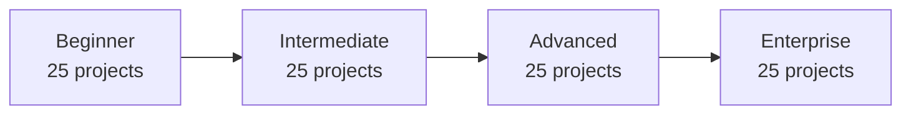
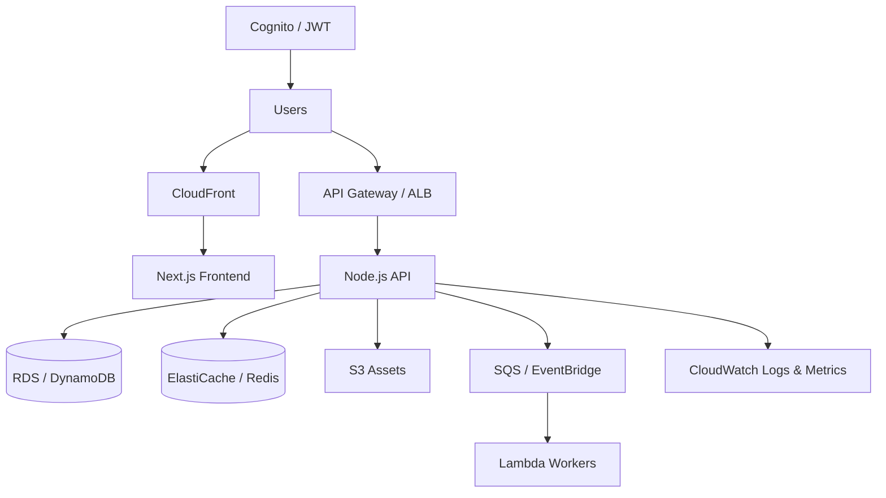

<div align="center">

# 100 Full Stack AWS Projects

**Production-grade full stack applications for cloud-native engineers, startup builders, and portfolio builders.**

[](LICENSE)
[](./projects)
[](https://aws.amazon.com)
[](https://nextjs.org)
[](https://www.typescriptlang.org)

[Learning Roadmap](#learning-roadmap) ·
[All Projects](#all-100-projects) ·
[Setup](#setup-guide) ·
[Deploy](#deployment-guide) ·
[Contribute](#contributing)

</div>

---

## Description

This repository is a curated library of **100 unique, real-world full stack projects** spanning **Beginner → Intermediate → Advanced → Enterprise** difficulty. Each project includes a **Next.js** frontend, **Node.js** API, **Docker** local stack, **Terraform** infrastructure, **architecture documentation**, and **AWS deployment guides**.

Built for engineers who want **resume-worthy portfolio work**, **interview preparation**, and **hands-on AWS experience** using the same patterns found at high-growth startups and cloud-native enterprises.

## Features

- **100 unique applications** — SaaS, marketplaces, AI platforms, DevOps tooling, enterprise systems
- **Consistent structure** — `frontend/`, `backend/`, `infrastructure/`, `docs/` in every project
- **Modern UI** — Tailwind CSS, glassmorphism dashboards, dark mode, Framer Motion
- **Security-first APIs** — JWT/OAuth, validation (Zod), rate limiting, Helmet, structured logging
- **AWS-native** — Cognito, Lambda, ECS/EKS, RDS, DynamoDB, S3, CloudFront, Bedrock, and more
- **DevOps ready** — Docker Compose, GitHub Actions, Terraform, AWS CDK stubs, monitoring patterns

## Tech Stack

| Layer | Technologies |
|-------|----------------|
| **Frontend** | Next.js 14, React 18, TypeScript, Tailwind CSS, Shadcn UI patterns, Zustand, Framer Motion |
| **Backend** | Node.js, Express.js, NestJS, GraphQL, REST, WebSockets |
| **Data** | PostgreSQL, MongoDB, Redis, DynamoDB, OpenSearch |
| **Auth** | JWT, OAuth 2.0, Auth.js, Amazon Cognito, Clerk-compatible patterns |
| **Cloud** | Amazon Web Services (30+ services across projects) |
| **DevOps** | Docker, Kubernetes, GitHub Actions, Terraform, AWS CDK, Nginx, CloudWatch |

## AWS Services Used

Across the monorepo you will work with:

`EC2` · `S3` · `CloudFront` · `Lambda` · `API Gateway` · `DynamoDB` · `RDS` · `Cognito` · `IAM` · `ECS` · `EKS` · `Amplify` · `SES` · `SNS` · `SQS` · `EventBridge` · `CloudWatch` · `Route53` · `VPC` · `Elastic Beanstalk` · `Step Functions` · `AppSync` · `Rekognition` · `Textract` · `Bedrock` · `OpenSearch` · `ElastiCache`

## Learning Roadmap



| Phase | Focus | You will learn |
|-------|--------|----------------|
| **Beginner** | CRUD, auth, dashboards | REST design, PostgreSQL/DynamoDB, Cognito basics |
| **Intermediate** | SaaS features, real-time | WebSockets, search, payments, multi-role apps |
| **Advanced** | AI, streaming, platform engineering | Bedrock, media pipelines, K8s, cost tooling |
| **Enterprise** | Compliance, scale, governance | SSO/SCIM, multi-region, GRC, service mesh |

**Recommended path:** Complete 2–3 beginner projects end-to-end, then pick intermediate projects aligned with your target role (e.g. ecommerce, fintech, AI). Advance to enterprise projects when comfortable with Terraform and multi-service AWS deployments.

## Repository Structure

```
100-fullstack-aws-projects/
├── projects/
│   ├── beginner/          # Projects 01–25
│   ├── intermediate/      # Projects 26–50
│   ├── advanced/          # Projects 51–75
│   └── enterprise/        # Projects 76–100
├── .github/workflows/     # CI/CD templates
├── docs/                  # Shared architecture & DevOps guides
├── scripts/               # Repository generators
├── CONTRIBUTING.md
├── LICENSE
└── README.md
```

Each project contains:

```
<project>/
├── README.md
├── architecture.md
├── docker-compose.yml
├── .env.example
├── frontend/              # Next.js app
├── backend/               # Express/NestJS API
├── infrastructure/        # Terraform + CDK
└── docs/                  # OpenAPI, deployment, screenshots
```

## All 100 Projects

| # | Project | Level | Tech | AWS Services | Learning Outcome |
|---|---------|-------|------|--------------|------------------|
| 01 | [Personal Expense Tracker](./projects/beginner/01-personal-expense-tracker) | Beginner | Next.js, Tailwind, Express | Cognito, RDS PostgreSQL, S3 receipts, CloudWatch | REST API design |
| 02 | [Team Todo Application](./projects/beginner/02-todo-app-with-teams) | Beginner | Next.js, Zustand, Express | Cognito, DynamoDB, AppSync, SNS | Multi-tenant data modeling |
| 03 | [Weather Intelligence Dashboard](./projects/beginner/03-weather-dashboard) | Beginner | Next.js, Framer Motion, Lambda | Lambda, API Gateway, DynamoDB, SNS… | Serverless APIs |
| 04 | [Modern Blogging Platform](./projects/beginner/04-blogging-platform) | Beginner | Next.js, MDX, Express | S3 media, CloudFront, RDS, SES | Content management |
| 05 | [Enterprise URL Shortener](./projects/beginner/05-url-shortener) | Beginner | Next.js, Express | Lambda, DynamoDB, CloudFront, Route53 | High-throughput redirects |
| 06 | [Contact Manager CRM Lite](./projects/beginner/06-contact-manager-crm-lite) | Beginner | Next.js, Shadcn UI, NestJS | RDS, SES, S3 attachments | NestJS modules |
| 07 | [Recipe Sharing Community](./projects/beginner/07-recipe-sharing-app) | Beginner | Next.js, Express | S3, Rekognition labels, RDS | File uploads |
| 08 | [Habit Streak Tracker](./projects/beginner/08-habit-tracker) | Beginner | Next.js, Tailwind, Express | Cognito, DynamoDB, EventBridge | Time-series UX |
| 09 | [Movie Watchlist & Reviews](./projects/beginner/09-movie-watchlist) | Beginner | Next.js, Express | Lambda, ElastiCache, RDS | External API caching |
| 10 | [Password Vault Lite](./projects/beginner/10-password-manager-lite) | Beginner | Next.js, Express | KMS, DynamoDB, Secrets Manager | Client-side encryption |
| 11 | [Event Countdown Planner](./projects/beginner/11-event-countdown-app) | Beginner | Next.js, Express | SES, SNS, RDS | Calendar integrations |
| 12 | [Fitness Workout Logger](./projects/beginner/12-fitness-workout-logger) | Beginner | Next.js, Recharts, Express | RDS, S3 progress photos, CloudWatch | Data visualization |
| 13 | [Personal Book Library](./projects/beginner/13-book-library-manager) | Beginner | Next.js, Express | Lambda, DynamoDB, S3 covers | Barcode/ISBN APIs |
| 14 | [Freelancer Invoice Generator](./projects/beginner/14-invoice-generator) | Beginner | Next.js, Express | S3 PDFs, SES email, RDS | PDF generation |
| 15 | [Poll & Survey Builder](./projects/beginner/15-poll-survey-builder) | Beginner | Next.js, Express | DynamoDB, Lambda, CloudFront | Form builders |
| 16 | [Synced Notes Application](./projects/beginner/16-notes-app-sync) | Beginner | Next.js, TipTap, Express | S3, OpenSearch, RDS | Full-text search |
| 17 | [Pomodoro Focus Studio](./projects/beginner/17-pomodoro-focus-timer) | Beginner | Next.js, Express | DynamoDB, CloudWatch metrics | Web Audio API |
| 18 | [Spaced Repetition Flashcards](./projects/beginner/18-flashcard-study-app) | Beginner | Next.js, Express | RDS, S3 audio, Lambda grading | Learning algorithms |
| 19 | [Pet Care & Health Tracker](./projects/beginner/19-pet-care-tracker) | Beginner | Next.js, NestJS | RDS, SNS reminders, S3 records | Reminder systems |
| 20 | [Local Business Directory](./projects/beginner/20-local-business-directory) | Beginner | Next.js, Mapbox, Express | OpenSearch, S3 images, RDS | Geo search |
| 21 | [Gift Wishlist Registry](./projects/beginner/21-gift-wishlist-app) | Beginner | Next.js, Express | DynamoDB, SES, SNS | Shareable resources |
| 22 | [Language Learning Quiz](./projects/beginner/22-language-learning-quiz) | Beginner | Next.js, Express | Polly TTS, RDS, ElastiCache | Audio integration |
| 23 | [Parking Spot Finder](./projects/beginner/23-parking-spot-finder) | Beginner | Next.js, Express | DynamoDB, Lambda, API Gateway | Geo-temporal data |
| 24 | [Vehicle Maintenance Log](./projects/beginner/24-car-maintenance-log) | Beginner | Next.js, Express | RDS, EventBridge, SES | Maintenance scheduling |
| 25 | [Plant Care Assistant](./projects/beginner/25-plant-watering-reminder) | Beginner | Next.js, Express | Rekognition, S3, RDS | ML image APIs |
| 26 | [E-Commerce Storefront](./projects/intermediate/26-ecommerce-storefront) | Intermediate | Next.js, Redux Toolkit, NestJS | RDS, S3 products, SES, CloudFront | Payment flows |
| 27 | [Real-Time Chat Application](./projects/intermediate/27-real-time-chat-app) | Intermediate | Next.js, Express | API Gateway WebSocket, DynamoDB, S3, ElastiCache | Real-time architecture |
| 28 | [Project Management SaaS](./projects/intermediate/28-project-management-tool) | Intermediate | Next.js, DnD Kit, NestJS | RDS, SQS workers, SNS, S3 attachments | Workflow engines |
| 29 | [Food Delivery Platform](./projects/intermediate/29-food-delivery-app) | Intermediate | Next.js, NestJS | RDS, SQS, SNS push, Location services | Multi-role systems |
| 30 | [Ride Booking Platform](./projects/intermediate/30-ride-booking-app) | Intermediate | Next.js, Express | DynamoDB, Lambda, SNS, Location | Matching algorithms |
| 31 | [Event Ticketing Platform](./projects/intermediate/31-event-booking-system) | Intermediate | Next.js, NestJS | RDS, S3 tickets, Lambda QR, SES | Ticketing systems |
| 32 | [Learning Management System](./projects/intermediate/32-lms-platform) | Intermediate | Next.js, NestJS | S3 video, CloudFront, RDS, MediaConvert | Video streaming |
| 33 | [Job Board & Applicant Tracking](./projects/intermediate/33-job-board-platform) | Intermediate | Next.js, NestJS | OpenSearch, S3 resumes, Textract, RDS | Search indexing |
| 34 | [Social Media Network](./projects/intermediate/34-social-media-app) | Intermediate | Next.js, Express | DynamoDB, S3, SQS fanout, ElastiCache | Feed algorithms |
| 35 | [Cloud File Storage System](./projects/intermediate/35-file-storage-system) | Intermediate | Next.js, NestJS | S3, CloudFront, Lambda triggers, IAM policies | S3 presigned URLs |
| 36 | [Email Marketing Campaign Tool](./projects/intermediate/36-email-campaign-tool) | Intermediate | Next.js, NestJS | SES, SQS, RDS, EventBridge | Bulk email |
| 37 | [Helpdesk Ticket System](./projects/intermediate/37-helpdesk-ticket-system) | Intermediate | Next.js, NestJS | RDS, SES, SNS, OpenSearch | SLA workflows |
| 38 | [Warehouse Inventory Management](./projects/intermediate/38-inventory-management) | Intermediate | Next.js, NestJS | RDS, SQS, S3 exports | Inventory workflows |
| 39 | [Appointment Scheduling SaaS](./projects/intermediate/39-appointment-scheduling) | Intermediate | Next.js, NestJS | RDS, SES, EventBridge, Stripe | Scheduling logic |
| 40 | [Real Estate Listings Portal](./projects/intermediate/40-real-estate-listings) | Intermediate | Next.js, NestJS | OpenSearch, S3 media, RDS, CloudFront | Property search |
| 41 | [Subscription Box Service](./projects/intermediate/41-subscription-box-service) | Intermediate | Next.js, NestJS | RDS, SQS fulfillment, SES | Subscription billing |
| 42 | [NFT Marketplace](./projects/intermediate/42-nft-marketplace-lite) | Intermediate | Next.js, Express | S3 metadata, Lambda, API Gateway, CloudFront | Web3 integration |
| 43 | [Crypto Portfolio Tracker](./projects/intermediate/43-crypto-portfolio-tracker) | Intermediate | Next.js, Express | Lambda price feeds, DynamoDB, ElastiCache | Financial data APIs |
| 44 | [Stock Market Analytics](./projects/intermediate/44-stock-market-tracker) | Intermediate | Next.js, NestJS | ElastiCache, RDS, Lambda ETL | Market data |
| 45 | [Travel Itinerary Planner](./projects/intermediate/45-travel-itinerary-planner) | Intermediate | Next.js, NestJS | RDS, S3 docs, SES invites | Collaborative editing |
| 46 | [Healthcare Patient Portal](./projects/intermediate/46-healthcare-patient-portal) | Intermediate | Next.js, NestJS | RDS encrypted, KMS, CloudTrail, SES | Healthcare compliance patterns |
| 47 | [Legal Document Manager](./projects/intermediate/47-legal-document-manager) | Intermediate | Next.js, NestJS | S3, KMS, CloudTrail, Textract | Audit trails |
| 48 | [Freelance Services Marketplace](./projects/intermediate/48-freelance-marketplace) | Intermediate | Next.js, NestJS | RDS, SQS, SES, S3 deliverables | Marketplace payments |
| 49 | [Podcast Hosting Platform](./projects/intermediate/49-podcast-hosting-platform) | Intermediate | Next.js, NestJS | S3 audio, CloudFront, Transcribe, RDS | Media hosting |
| 50 | [Video Course Platform](./projects/intermediate/50-video-course-platform) | Intermediate | Next.js, NestJS | S3, CloudFront signed URLs, RDS | Protected streaming |
| 51 | [AI SaaS Platform](./projects/advanced/51-ai-saas-platform) | Advanced | Next.js, Zustand, NestJS | Bedrock, Lambda, DynamoDB, API Gateway… | AI product architecture |
| 52 | [AI Website Builder](./projects/advanced/52-ai-website-builder) | Advanced | Next.js, NestJS | Bedrock, S3 sites, CloudFront, Lambda | Generative UI |
| 53 | [AI Resume Builder](./projects/advanced/53-ai-resume-builder) | Advanced | Next.js, NestJS | Bedrock, S3, Lambda, SES | LLM document generation |
| 54 | [AI Interview Preparation](./projects/advanced/54-interview-prep-app) | Advanced | Next.js, NestJS | Bedrock, Transcribe, Polly, S3 recordings | Voice AI |
| 55 | [AI Code Review Platform](./projects/advanced/55-ai-code-reviewer) | Advanced | Next.js, NestJS | Lambda, SQS, Bedrock, Secrets Manager | GitHub webhooks |
| 56 | [AI Image Generation Studio](./projects/advanced/56-ai-image-generator) | Advanced | Next.js, Express | Bedrock, S3, CloudFront, DynamoDB | Image gen APIs |
| 57 | [AI Voice Assistant Platform](./projects/advanced/57-ai-voice-assistant) | Advanced | Next.js, NestJS | Bedrock, Transcribe, Polly, WebSocket API | Voice pipelines |
| 58 | [AI Document Analyzer](./projects/advanced/58-ai-document-analyzer) | Advanced | Next.js, NestJS | Textract, Bedrock, S3, SQS | RAG pipelines |
| 59 | [Video Streaming Platform](./projects/advanced/59-video-streaming-platform) | Advanced | Next.js, NestJS | S3, MediaConvert, CloudFront, Lambda@Edge | Video pipelines |
| 60 | [Multi-Vendor Marketplace](./projects/advanced/60-multi-vendor-ecommerce) | Advanced | Next.js, NestJS | RDS, SQS, SES, S3 | Marketplace architecture |
| 61 | [Enterprise CRM Software](./projects/advanced/61-crm-software) | Advanced | Next.js, NestJS | RDS, OpenSearch, SES, EventBridge | CRM data models |
| 62 | [HR Management System](./projects/advanced/62-hr-management-system) | Advanced | Next.js, NestJS | RDS, S3 docs, Cognito, SES | HR workflows |
| 63 | [DevOps Monitoring Platform](./projects/advanced/63-devops-monitoring-platform) | Advanced | Next.js, NestJS | CloudWatch, OpenSearch, SNS, Lambda | Observability |
| 64 | [Kubernetes Operations Dashboard](./projects/advanced/64-kubernetes-dashboard) | Advanced | Next.js, NestJS | EKS, CloudWatch, IAM, Prometheus | K8s API integration |
| 65 | [AWS Cost Monitoring Tool](./projects/advanced/65-aws-cost-monitor) | Advanced | Next.js, NestJS | Cost Explorer API, Lambda, DynamoDB, SNS | FinOps |
| 66 | [AI Workflow Automation](./projects/advanced/66-ai-workflow-automation) | Advanced | Next.js, NestJS | Step Functions, Lambda, EventBridge, DynamoDB | Workflow engines |
| 67 | [Serverless SaaS Platform](./projects/advanced/67-serverless-saas-starter) | Advanced | Next.js Amplify, Lambda SAM | Lambda, API Gateway, DynamoDB, Cognito | Serverless SaaS |
| 68 | [Cloud IDE Platform](./projects/advanced/68-cloud-ide-platform) | Advanced | Next.js, NestJS | ECS, EFS, ALB, Cognito | Container workspaces |
| 69 | [Blockchain Explorer Lite](./projects/advanced/69-blockchain-explorer-lite) | Advanced | Next.js, Express | OpenSearch, Lambda indexers, DynamoDB | Blockchain indexing |
| 70 | [IoT Device Management Dashboard](./projects/advanced/70-iot-device-dashboard) | Advanced | Next.js, NestJS | IoT Core, Timestream, Lambda, SNS | IoT architectures |
| 71 | [Fraud Detection Dashboard](./projects/advanced/71-fraud-detection-dashboard) | Advanced | Next.js, NestJS | SageMaker, Kinesis, OpenSearch, SNS | Fraud pipelines |
| 72 | [Data Pipeline Orchestrator](./projects/advanced/72-data-pipeline-orchestrator) | Advanced | Next.js, NestJS | Glue, Step Functions, S3, CloudWatch | ETL orchestration |
| 73 | [Custom Search Engine Platform](./projects/advanced/73-search-engine-platform) | Advanced | Next.js, NestJS | OpenSearch, Lambda crawlers, S3 | Search relevance |
| 74 | [API Gateway Management Portal](./projects/advanced/74-api-gateway-management) | Advanced | Next.js, NestJS | API Gateway, Lambda, DynamoDB, CloudWatch | API productization |
| 75 | [Feature Flag Service](./projects/advanced/75-feature-flag-service) | Advanced | Next.js, NestJS | AppConfig, DynamoDB, CloudWatch, Lambda | Feature delivery |
| 76 | [Enterprise ERP Lite](./projects/enterprise/76-enterprise-erp-lite) | Enterprise | Next.js, NestJS microservices | RDS Multi-AZ, EKS, SQS, KMS | ERP domain modeling |
| 77 | [Enterprise Data Lake Platform](./projects/enterprise/77-enterprise-data-lake) | Enterprise | Next.js, NestJS | S3 Lake, Glue, Athena, Lake Formation | Data lake architecture |
| 78 | [Enterprise Identity Platform](./projects/enterprise/78-enterprise-identity-platform) | Enterprise | Next.js, NestJS | Cognito, IAM Identity Center, KMS, CloudTrail | Enterprise IAM |
| 79 | [Enterprise API Service Mesh](./projects/enterprise/79-enterprise-api-mesh) | Enterprise | Next.js, Go microservices | EKS, App Mesh, X-Ray, CloudWatch | Service mesh |
| 80 | [Enterprise BPM Suite](./projects/enterprise/80-enterprise-bpm-suite) | Enterprise | Next.js, NestJS | Step Functions, RDS, EventBridge, OpenSearch | BPMN workflows |
| 81 | [Enterprise Governance Portal](./projects/enterprise/81-enterprise-governance-portal) | Enterprise | Next.js, NestJS | RDS, S3 evidence, CloudTrail, Config | GRC systems |
| 82 | [Enterprise Observability Suite](./projects/enterprise/82-enterprise-observability-suite) | Enterprise | Next.js, NestJS | AMP, AMG, X-Ray, OpenSearch | SRE practices |
| 83 | [Multi-Region SaaS Platform](./projects/enterprise/83-enterprise-multi-region-saas) | Enterprise | Next.js, NestJS | Route53, RDS Global, DynamoDB Global, CloudFront | Global architecture |
| 84 | [Supply Chain Control Tower](./projects/enterprise/84-enterprise-supply-chain) | Enterprise | Next.js, NestJS | RDS, IoT, Forecast, EventBridge | Supply chain systems |
| 85 | [Insurance Policy Platform](./projects/enterprise/85-enterprise-insurance-platform) | Enterprise | Next.js, NestJS | RDS, Step Functions, Textract, SES | Insurance workflows |
| 86 | [Digital Banking Portal Lite](./projects/enterprise/86-enterprise-banking-portal) | Enterprise | Next.js, NestJS | RDS encrypted, KMS, CloudTrail, Fraud Detector | Banking patterns |
| 87 | [Telehealth Enterprise Platform](./projects/enterprise/87-enterprise-telehealth) | Enterprise | Next.js, NestJS | Chime SDK, RDS, KMS, S3 records | Telehealth |
| 88 | [Manufacturing MES Lite](./projects/enterprise/88-enterprise-manufacturing-mes) | Enterprise | Next.js, NestJS | IoT Core, Timestream, RDS, QuickSight | MES systems |
| 89 | [Retail Order Management System](./projects/enterprise/89-enterprise-retail-oms) | Enterprise | Next.js, NestJS | RDS, SQS, EventBridge, Lambda | OMS architecture |
| 90 | [Enterprise Marketing Hub](./projects/enterprise/90-enterprise-marketing-hub) | Enterprise | Next.js, NestJS | Pinpoint, Kinesis, OpenSearch, S3 | Marketing automation |
| 91 | [Enterprise Event Ticketing](./projects/enterprise/91-enterprise-ticketing-platform) | Enterprise | Next.js, NestJS | RDS, ElastiCache, CloudFront, Lambda | High-scale ticketing |
| 92 | [Enterprise Asset Management](./projects/enterprise/92-enterprise-asset-management) | Enterprise | Next.js, NestJS | RDS, S3 docs, IoT, Config | EAM systems |
| 93 | [Enterprise Vendor Portal](./projects/enterprise/93-enterprise-vendor-portal) | Enterprise | Next.js, NestJS | RDS, S3, Textract, SES | Vendor management |
| 94 | [Enterprise Knowledge Base](./projects/enterprise/94-enterprise-knowledge-base) | Enterprise | Next.js, NestJS | OpenSearch, Bedrock, S3, Kendra optional | Enterprise search |
| 95 | [Contract Lifecycle Management](./projects/enterprise/95-enterprise-contract-lifecycle) | Enterprise | Next.js, NestJS | S3, Textract, Step Functions, RDS | CLM workflows |
| 96 | [Disaster Recovery Orchestrator](./projects/enterprise/96-enterprise-disaster-recovery) | Enterprise | Next.js, NestJS | Route53 failover, RDS replicas, Step Functions, CloudFormation | DR planning |
| 97 | [Zero Trust Access Gateway](./projects/enterprise/97-enterprise-zero-trust-access) | Enterprise | Next.js, NestJS | IAM, Verified Access, CloudTrail, WAF | Zero trust |
| 98 | [AI Governance & Model Registry](./projects/enterprise/98-enterprise-ai-governance) | Enterprise | Next.js, NestJS | SageMaker, Bedrock, S3, CloudTrail | AI governance |
| 99 | [Privacy & Consent Management](./projects/enterprise/99-enterprise-privacy-portal) | Enterprise | Next.js, NestJS | RDS, Lambda, Macie, CloudTrail | Privacy compliance |
| 100 | [Enterprise Integration Hub](./projects/enterprise/100-enterprise-integration-hub) | Enterprise | Next.js, NestJS | EventBridge, SQS, Lambda, API Gateway | Integration patterns |

## Setup Guide

### Prerequisites

- **Node.js** 20 LTS
- **Docker** & **Docker Compose**
- **AWS CLI** v2 with configured profile
- **Terraform** 1.6+ (for infrastructure modules)

### Clone and explore

```bash
git clone https://github.com/your-org/100-fullstack-aws-projects.git
cd 100-fullstack-aws-projects
```

### Run any project locally

```bash
cd projects/beginner/01-personal-expense-tracker
cp .env.example .env
docker compose up -d
cd backend && npm install && npm run dev
cd ../frontend && npm install && npm run dev
```

- Web UI: http://localhost:3000  
- API: http://localhost:4000  
- Health: http://localhost:4000/health  

## Deployment Guide

1. Provision infrastructure: `cd infrastructure/terraform && terraform apply`
2. Build and push container images to **ECR**
3. Deploy API to **ECS Fargate** or **Lambda** (serverless projects)
4. Host frontend on **Amplify** or **S3 + CloudFront**
5. Configure **Route53**, **ACM** certificates, and **WAF**
6. Set **CloudWatch** alarms for latency and 5xx errors

See [docs/deployment-overview.md](./docs/deployment-overview.md) and per-project `docs/deployment.md`.

## DevOps

| Tool | Location |
|------|----------|
| GitHub Actions CI | [.github/workflows/ci.yml](./.github/workflows/ci.yml) |
| Terraform example | [docs/examples/terraform/](./docs/examples/terraform/) |
| Docker Compose | Each project `docker-compose.yml` |
| Kubernetes sample | [docs/examples/kubernetes/](./docs/examples/kubernetes/) |

## Cloud Architecture

High-level pattern used across most projects:



## Contributing

We welcome contributions! See [CONTRIBUTING.md](./CONTRIBUTING.md) for branch naming, code standards, and PR checklist.

## Screenshots

Add screenshots to each project's `docs/screenshots/` directory. The UI uses a consistent dark glassmorphism design system inspired by Vercel, Linear, and the AWS Console.

## License

MIT License — see [LICENSE](./LICENSE).

## Contact

- **Issues:** GitHub Issues for bugs and feature requests
- **Discussions:** Architecture questions and roadmap ideas
- **Maintainer:** Open an issue with tag `question` for mentorship-style guidance

---

<p align="center">Built for engineers who ship. Star the repo if it accelerates your cloud journey.</p>
